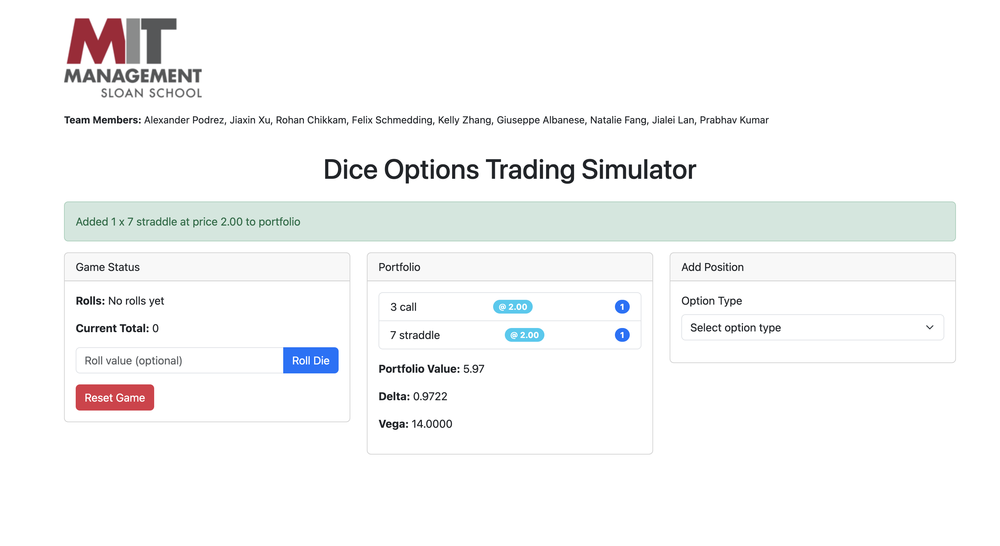

# Dice Options Trading Simulator

## Overview

The Dice Options Trading Simulator is an educational tool designed to teach options trading concepts through a simplified dice-based market. The simulator uses the outcome of rolling two dice as the underlying "asset price," allowing users to trade various option strategies and learn about concepts like delta, vega, and portfolio management in a controlled environment.

## Features

- **Simple Underlying Asset**: The sum of two dice (values 2-12) serves as the market price
- **Multiple Option Types**: Trade calls, puts, straddles, strangles, spreads, and risk reversals
- **Real-time Analytics**: View delta, vega, and portfolio value calculations
- **Portfolio Management**: Build and manage a portfolio of option positions
- **Interactive Interface**: Roll dice and see immediate impact on option values

## Option Strategies Available

- **Call Options**: Profit when the dice roll exceeds the strike price
- **Put Options**: Profit when the dice roll is below the strike price
- **Straddle**: Combination of a call and put at the same strike price
- **Strangle**: Combination of a call and put at different strike prices
- **Call Spread**: Combination of a long call and short call at different strikes
- **Put Spread**: Combination of a long put and short put at different strikes
- **Risk Reversal**: Combination of a long put and short call at different strikes

## How It Works

1. Select an option type and parameters (strike price, quantity)
2. Add positions to your portfolio at the displayed bid/ask prices
3. Roll the dice to simulate market movement
4. See how your portfolio value changes based on the dice outcome
5. Learn about option pricing, greeks, and risk management

## Educational Concepts

- **Option Pricing**: Learn how probability affects option values
- **Delta**: Understand how options respond to changes in the underlying asset
- **Vega**: See how options are sensitive to volatility
- **Portfolio Management**: Practice building delta-neutral portfolios
- **Risk Management**: Experience the impact of diversification and hedging

## Development

This project was developed by a team from MIT Sloan School of Management:
Alexander Podrez, Jiaxin Xu, Rohan Chikkam, Felix Schmedding, Kelly Zhang, Giuseppe Albanese, Natalie Fang, Jialei Lan, Prabhav Kumar

## Technical Details

The simulator is built using Python with a web interface. The core options pricing logic uses probability theory based on dice outcomes rather than traditional Black-Scholes modeling, making it more intuitive for educational purposes.

## Getting Started

1. Clone this repository
2. Install dependencies: `pip install -r requirements.txt`
3. Run the application: `python app.py`
4. Access the simulator in your web browser at `http://localhost:5000`

## Testing

Run the test suite to verify the option pricing and portfolio calculations:
